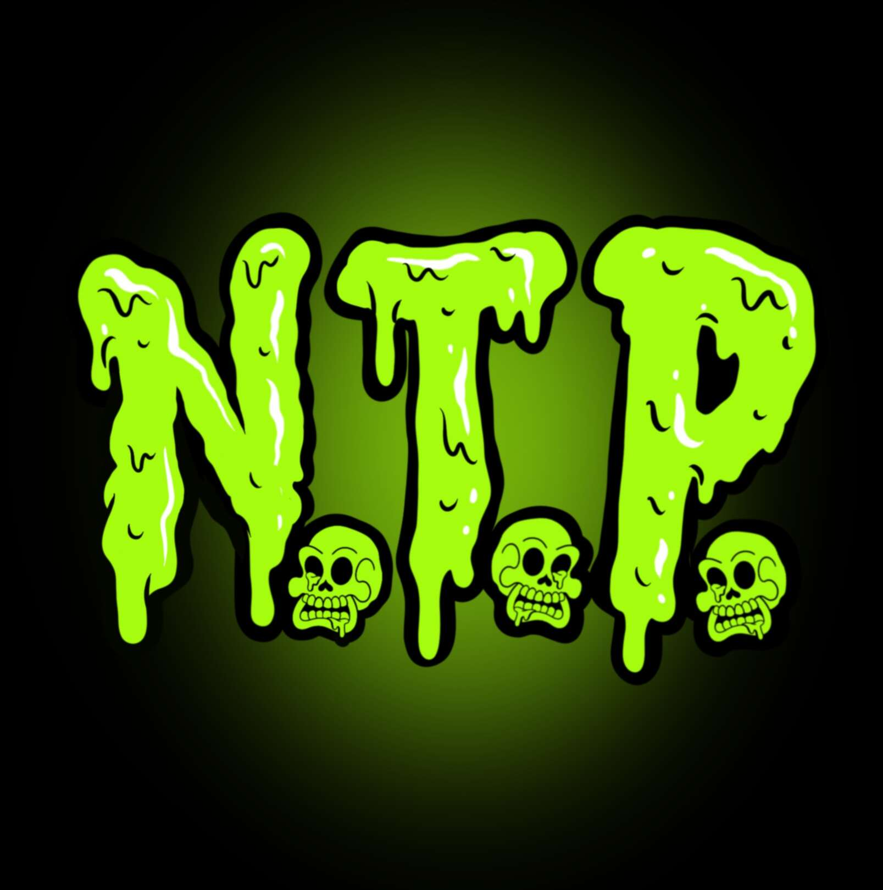

# N.T.P. Canisters by Toxic Skulls Club

在遥远的土地上，骷髅在森林中漫游，寻找生命之河！他们渴望再次成为凡人，他们继续寻找，直到有一天他们找到了一条河流。这条河流以明亮柔和的色彩流淌，使这些骷髅陷入恍惚状态。他们毫不犹豫的全部冲了进去！当每个人从河里出来时，他们都震惊地发现他们都被变异成了毒骷髅。这条河不是生命之河，而是有毒之河！Toxic Skulls 成立了一个俱乐部，以他们新的毒化自我出发并征服世界！

当您购买有毒骷髅头时，您不仅仅是购买了一件稀有的艺术品。您购买的俱乐部的利益会随着时间的推移而增加。你的毒骷髅可以成为你的数字身份，为你打开数字机会。

有毒头骨以 ERC-721 代币的形式存储在以太坊区块链上，并托管在 IPFS 上。每个持有者都被赋予其 NFT 的所有权和商业使用权。

