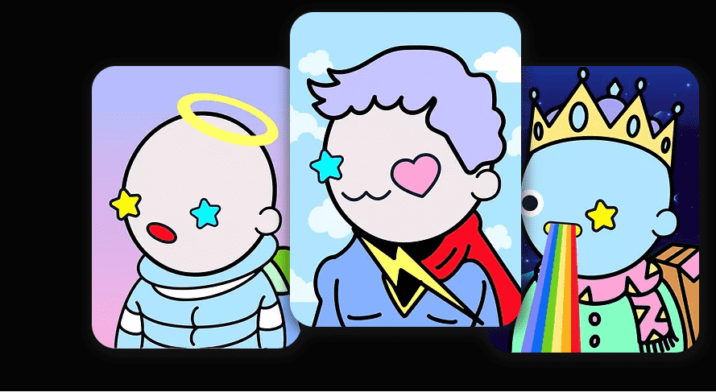

# Nubbies Genesis

999 个完全动画的 NFT 集合丢失在以太坊区块链上，由泰国团队以爱和热情手工设计。

 这些顽皮的角色正在寻找新家，并希望通过他们的持有者彼此团结。正如大多数 web 3.0 冒险者所知道的那样，在 Web3.0 空间中航行可能会很孤独。这就是为什么我们希望从 999 件的少量供应开始，以便每个人都可以密切了解彼此并长期建立密切的关系。

创始人和团队成员完全被一个活跃且不断发展的社区所吸引。

他们设想通过引入不同的机制来奖励 NFT 的长期持有者，这些机制将为 NFT 空间之外的社区钱包提供资金，例如 DeFi 协议和 P2E 领域。

