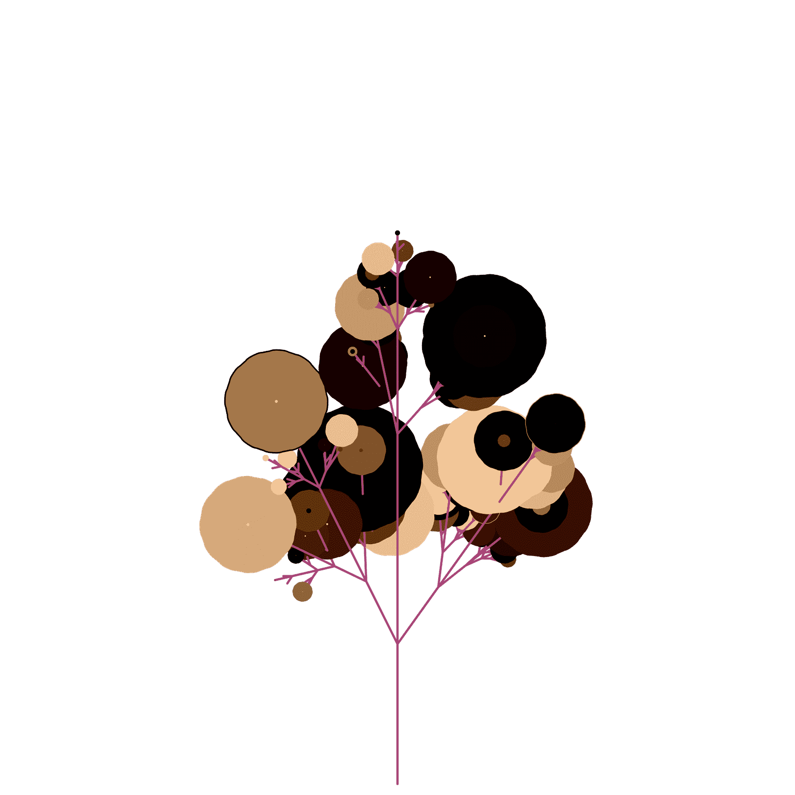

# NuBloom Fractal

NuBloom: Fractal 是使用 Lindenmayer 系统生成的 8888 种独特花卉的集合，该系统迭代地重写字符串以创建分形图案。该系列将在购买时自动在 OpenSea 上铸造，并将成为第一代 NuBloom 花。每一代人都会有自己独特的审美。

每个 NFT 都是独一无二的，高分辨率艺术品包含程序生成的名称、物种和嵌入在元数据中的描述。nft 的保留人将拥有以他们希望的任何创意或商业方式使用花卉艺术和文字的全部权利。

