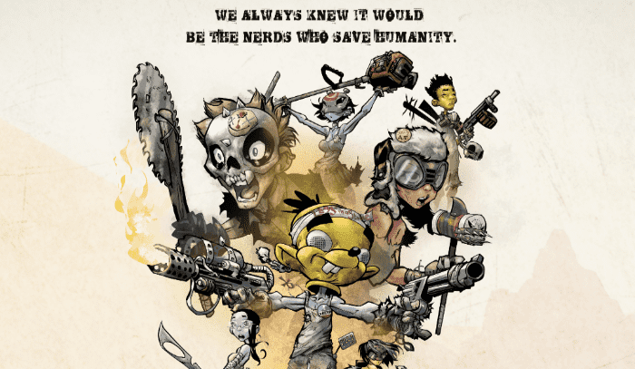

# Nuclear Nerds of the Accidental Apocalypse

**沉浸在我们不幸的未来的故事中。**

意外启示录的核书呆子不仅仅是 8,999 名男性和女性 NFT 的简单集合，它是一个叙事故事世界的起点，将通过一系列未来的掉落和独特的机制来讲述。我们角色的需求、愿望、希望、梦想和目标将指引前进的方向，而代币持有者将帮助共同撰写故事。

如果您喜欢收集 NFT、精彩的故事讲述和惊喜，我们邀请您抓住您的书呆子并帮助他们成功完成拯救我们所有人的艰巨任务。人类的未来掌握在你的手中。别搞砸了。

**书呆子无路可走**

每个好故事都充满惊喜，我们不想在开始之前破坏结局。但我们会这么说——我们计划了一些非常棒的狗屎。

同时，就像任何好的社区一样，我们也在这里倾听和调整。因为如果我们了解到关于天启的一件事，那就是如果我们不一起工作，就没有人能够幸存。我们可以保证的是，每个人都会有大量的情节曲折、谜团和惊喜。

**认识核书呆子背后的书呆子**

你可能不知道我们的名字，但我们已经创造了一个职业故事，有时是为我们自己，但最常见的是为其他人，包括许多品牌。

DC（无漫画从属关系）为宝马制作了许多电影，演员有克莱夫·欧文（Clive Owen），导演有盖·里奇（Guy Richie）和吴宇森（John Woo），而 hotshave 曾与迈克·贾奇（Mike Judge）等人合作，并且是全球 Share a Coke 活动的幕后推手。

我们一起找到了令人难以置信的艺术家、插画家和平面小说创作者亚当·阿彻，以及人类瑞士军刀麦克伦基和大自然的创意商业开发力量西蒙。

我们都将我们的心血、灵魂和好点子倾注于核书呆子中，以备不时之需。我们希望您加入我们的旅程，并发现我们在商店中的所有曲折。向前！
