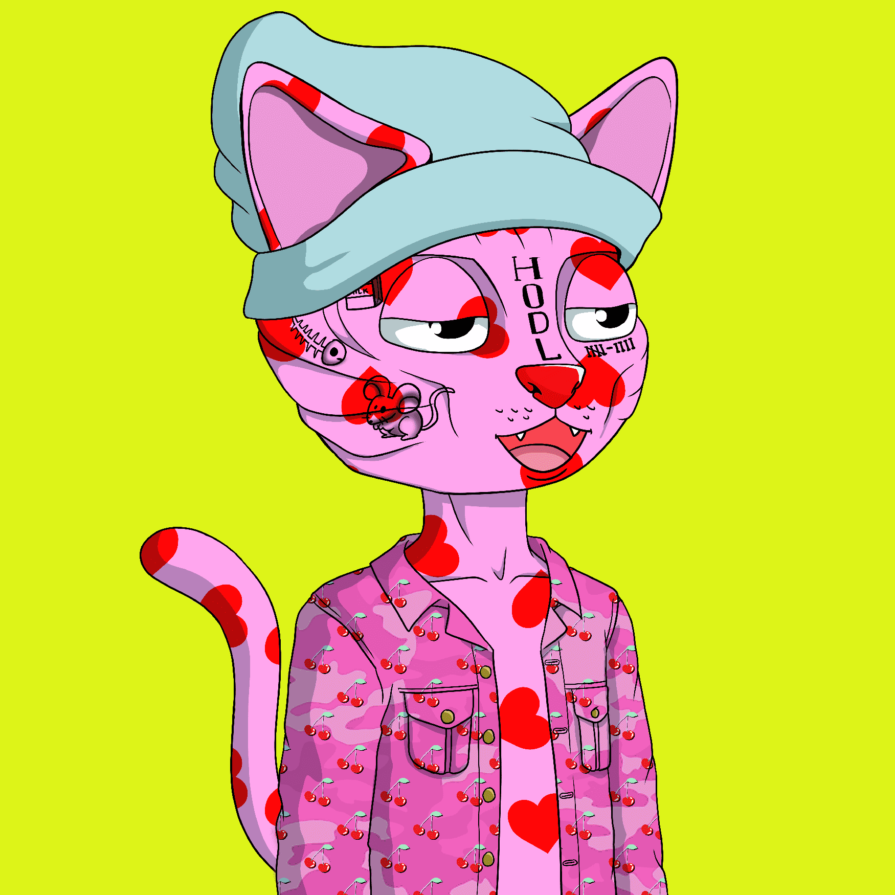

# Nudie Community Official

Nudies 是由 Hayley Elsaesser 设计的 816 个特征组成的 10,000 个 NFT 的集合。

每个 NFT 都拥有专有的 IP 权利和 Nudie 社区的会员资格。成员资格包括功能实用的实用程序和不断增长的社区驱动功能。

DAO 是一个建立在以太坊上的去中心化自治组织。成为我们社区的一员意味着您可以帮助就 Nudie 生态系统的未来做出决策。

NUDIE COMMUNITY NFT 不仅是外观惊人的 PFP，而且能够适应不断变化的虚拟世界……

随着 WEB3 的不断发展，NUDIE 社区也将不断发展！通过我们的 DAO 和社区基金，我们将扩展 NUDIEverse，使其与最新、最伟大的元宇宙生态系统和世界相结合。目前，我们在 Decentraland 拥有两块地块，将用于打造会员专属的聚会场所、俱乐部会所、游戏和互动体验。

