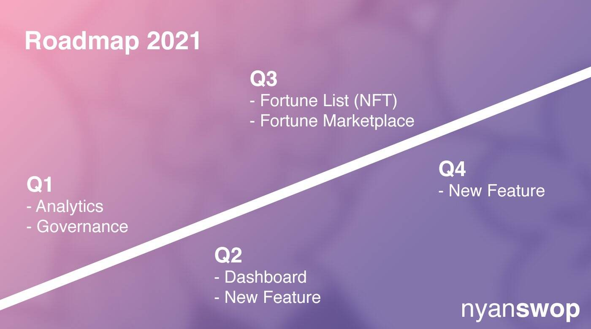

# Nyanswop

**Nyanswop，币安智能链的独角兽。**

币安智能链于2020年9月上线。在一个月内，平衡计分卡邀请了许多项目进入其环境，尽管并非所有项目都是出于好意。人们需要一个安全的地方进行交易，因此在2020年10月，Nyanswop推出。然而，由于过去半年发生的事情，我们无法继续开发该项目，并将随着时间的推移逐渐终止我们的支持。

在大部分时间里，我们一直是一个被动和安静的团队，因为我们真的希望尽可能地保持平衡计分卡的和平与合作。但现在是讲述我们所发生的事情的完整故事的好时机，我们希望未来的项目（甚至用户）能够从我们在这里的经验中受益。

以下为路线图

