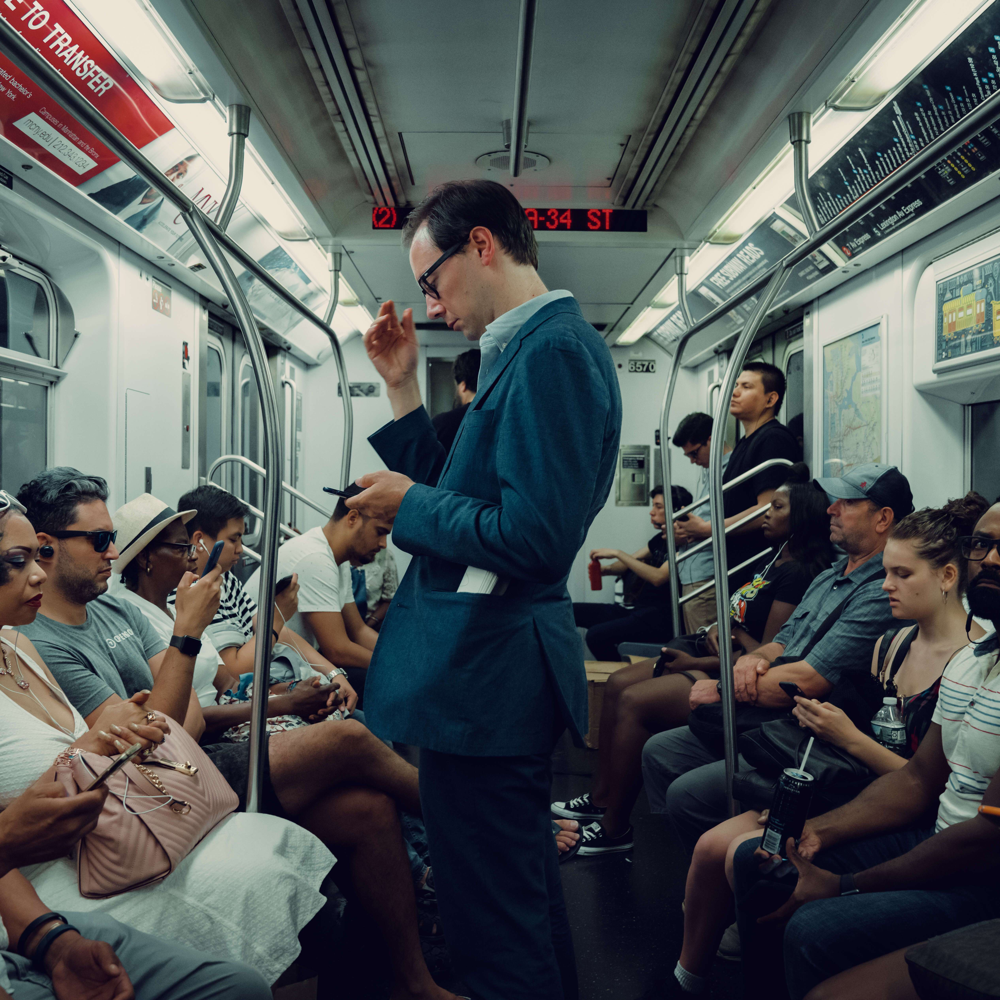

# NYC Underground Stories

想象一下纽约地铁和每天发生的数百万个人互动。想一想人们彼此表达爱意的所有可能方式——在等待火车到达时，坐在地铁车厢上，睁大眼睛和人们注视着，或者在牵手时，渴望那一刻能再持续一点。

在纽约的街道之下，你会发现地下——它本身就是一个世界。这是一个在一天中的每一刻都创造和体验这样的时刻的地方。在这里，在混乱和污垢中被忽视的巨大美景。在我最新的系列《纽约地下故事》中，我的目的是永远寻找、庆祝和保存这些时刻。

