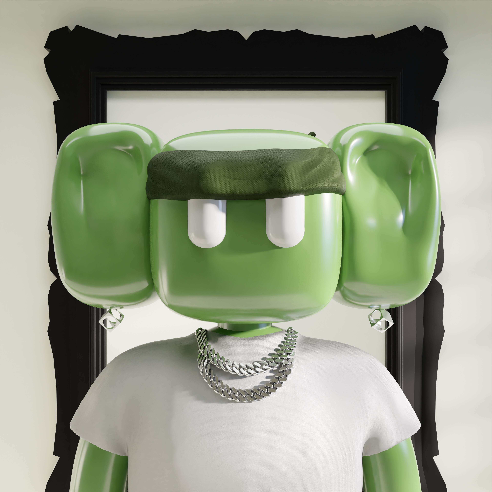

# Nyokies

Nyoki彗星将数千种不同的特殊小物种从另一个宇宙带到了日本。这些生物以坠落地球的彗星命名...... Nyokies 多年来一直在富士山上过着他们的秘密生活，但现在他们都准备好探索东京的街道......最终探索世界！

Nyoki Club 的创始人创造了独特的随机 Nyoki，其中包括 2,732 个 3D 和 4K 分辨率的角色。Nyokies 看起来像大型粘土模型熊，身体笨重，肩膀低，耳朵突出，眼睛大而垂直。

几乎无穷无尽的组合，保证所有 Nyokies 都是独一无二的，无缝可爱。

