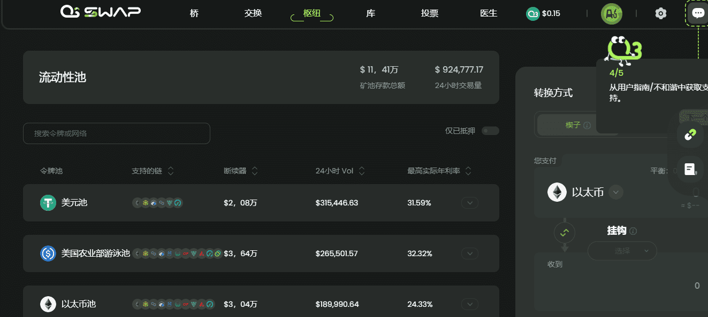

# O3 Swap

**什么是O3 Swap？**

O3 Swap是第一个跨链聚合协议，通过在不同的公链和Layer2上部署“聚合器+资产跨链池”，实现异构链之间原生资产的自由交易，为用户提供一键实现跨链交易。

目前，它可以访问Heco，ETH，BSC，Neo，并将在未来扩展到Polkadot，Polygon，Solana和其他生态系统。

O3 Swap的版本2，正式命名为“O3 Interchange”，将是一个跨链DEX，与众不同，因为它除了在不同链之间桥接相同的令牌外，还提供服务，而是交换异构或不同的数字资产。除了像 V1 那样在源链上聚合 DEX 之外，O3 Interchange 还将聚合目标链上的 DEX。这意味着用户将有更多的目标资产选择。

O3 Interchange由一个致力于为Web 3.0构建可互操作聚合器的团队设计，该聚合器为跨链交易提供了通用解决方案。该设计与O3社区的反馈紧密结合，以推动当前技术可能性的界限。O3 Labs将继续密切关注市场上现有的跨链解决方案，并将根据$O 3持有者的意愿，通过O3 DAO不断改进协议，该协议应在2022年第一季度末或2022年第二季度的某个时候进行改进和发布。

Swap和Bridge的新跨链机制允许简单的一次性确认交易。此外，他们将能够支持更多与EVM兼容的链和令牌。另外，O3 Labs团队还将提供一个加油站，以解决每条链条上的燃气费需求。通过换乘站和加油站的停靠站，用户可以更好地进入Web 3.0高速公路。
