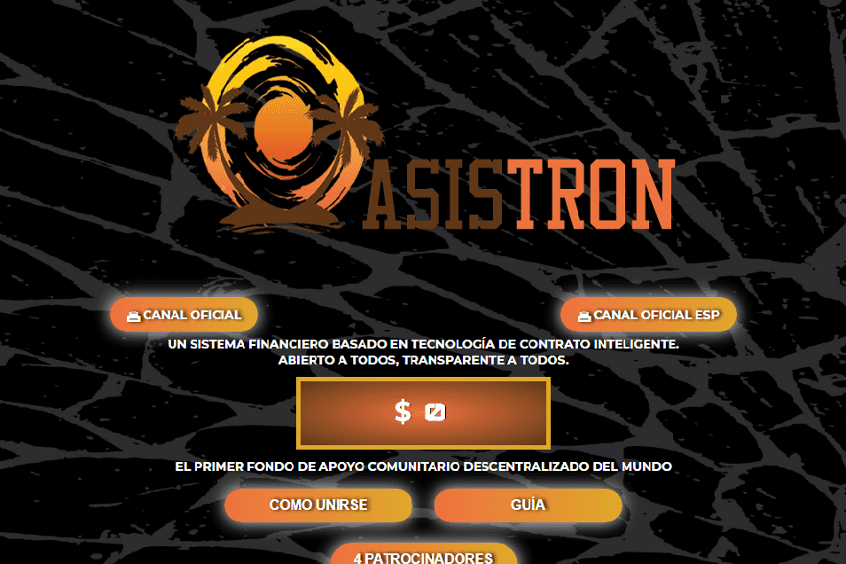

# OasisTRON

**什么是OasisTRON？**

OasisTRON在基金中存入至少100 TRX。当120%通过4种形式中的任何一种累积时，120%以4种方式（1被动和3通过营销）返还，必须进行等于或更高的新存款才能继续从基金接收。
3%每日存款回报（最多40天）100%负债。

直接推荐佣金10%，以分享和发展社区基金。

合作伙伴每次提款时的每日收入对应佣金1.一代人 30% 2.一代人 10% 3.一代人 10% 4.一代人 10% 5.一代人 10% 6.一代人 8% 7.一代人 8% 8.一代人 8%10.一代人 8% 11.一代人 5% 12.一代人 5% 13.一代人 5% 第14代 5% 第15代 5%1每个合伙人激活新级别直接，最多15级，见下文

每日主要参考小组3%，在小组中预订的所有存款中，每24小时，该小组的10%在数量上由前4名赞助商共享最小和最大周期限制。

第一周期，最低存款1000 TRX，最高100000 TRX。

第二次循环，等于或大于前一个油箱，最高可达300 000 TRX。

第3个循环，等于或大于前一个油箱，最高可达900 000 TRX。

第4个循环及以后，等于或大于前一个油箱，最高可达2 000 000 TRX。

