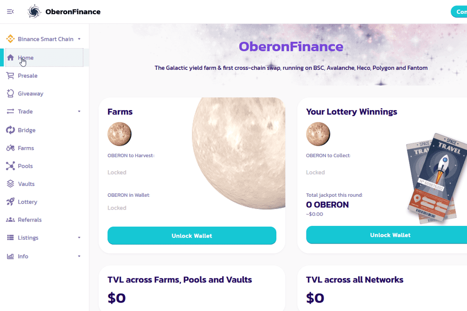

# OberonFinance

该项目在币安智能链，Avalanche，Huobi ECO（Heco），Polygon和Fantom上同时推出，在这5条链之间提供了最容易使用的跨链交换以及收益农场和自动复利金库。

OberonFinance是一个投资平台。它驻留在Polygon，Fantom，Heco，Avalanche和BSC网络上。该平台允许用户在这些网络之间轻松交换令牌。此外，它还为用户提供收益农场和自动复合保管库。因此，用户可以使用此dApp获得被动收入。

**奥伯伦金融DAPP技术分析**

OberonFinance dApp是建立在Polygon协议上的DeFi类别的加密资产。现在，根据用户数量，它在一般的dApp排名中排名第573位，在DeFi类别中排名第197位，这使您可以很好地了解OberonFinance dApp在其竞争对手中的表现。

通过分析OberonFinance dApp在过去30天内的数据，很明显，dApp的余额为0.00美元，交易量稳定在0.00美元。OberonFinance已经产生了204笔交易，在30天内增长了11.48%。显然，与前7天相比，交易量稳定了0%。过去7天的数据显示，OberonFinance的用户群为204，一直在增长8.7%。
我们还建议查看OberonFinance Activity Overview和平衡智能合约图表，以了解这些重要指标如何随时间波动和变化。
