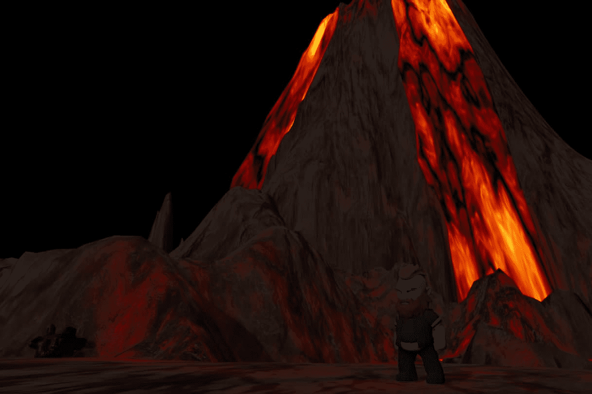

# Obertham NFT

Obertham NFT是一款结合了5种游戏模式的RPG游戏。我们只奖励那些有能力设计制胜策略的人。

Obertham是一个由中央岛屿（Obertham City）管理的浮动空间系统，由于Obertanos产生的重力，发现了8个围绕它旋转的岛屿，Oberthanos是居住在上述岛屿上的8个不同种族的公民。

梦幻般的NFT角色扮演游戏 - 玩赢 - 5种游戏模式|每日任务，农业，大逃杀，PvE，陆地战争。

