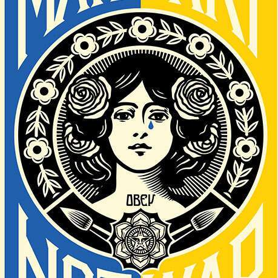

# Obey Make Art Not War Ukraine

我很高兴地宣布将于2022 年 9 月 25 日至 2023 年 7 月 23 日在德克萨斯州达拉斯当代艺术中心举办我的首次个展！我的展览 Backward Forward 解决了美国和整个地球面临的许多关键问题。该作品在美学和概念上采用了多种方法，但始终如一地提出问题——“我们是在前进还是后退？” “我们希望未来是什么样子？” 我很高兴能在达拉斯当代艺术中心分享这些作品，因为我认为场地和机构的愿景为我提供了一个分享我的艺术的强大机会。我还认为，达拉斯是一个充满活力的国际大都市，代表着多元文化和政治理念，非常适合进行强有力的社会、政治和创造性对话。查看达拉斯当代以了解更多详情。希望在那里见到你！

