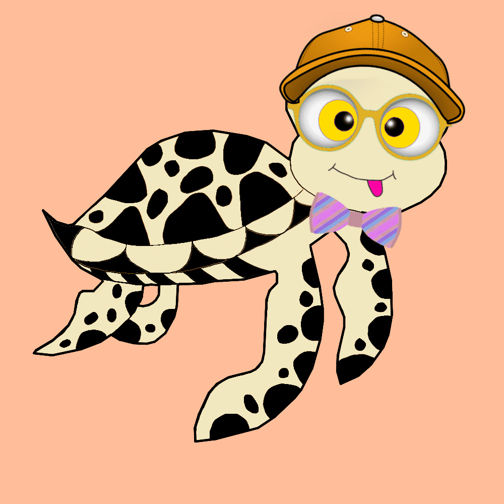

# Ocean-Project-Turtles

Ocean Project Turtles 是一个全新的集合，包含 10,000 个独特的 NFT，它们生活在 Polygon 区块链上——No Gas。每只海龟都是手绘的，由算法随机生成并 100% 归您所有。它不能被复制、带走或破坏。

我们为我们制作的每个系列都赠送像素化 NFT，以提高人们对即将推出的海洋项目的认识。

我们每周将赠送 3 个 nft。上面有宝箱的海龟是最稀有的！规则是：您只需要持有一只或多只海龟，并且您必须喜欢、转发、评论 Twitter 上的每周抽奖活动。

海洋项目的主要目标是向帮助/帮助清洁海洋的慈善机构捐款。每个季度 The Ocean Project 将捐赠一定比例并在推特上发布收据作为证明。

我们将向全球多个慈善机构捐款。我们希望对海洋的清洁产生真正的影响。协助清除和减少塑料垃圾、微塑料和多余的渔网等。

