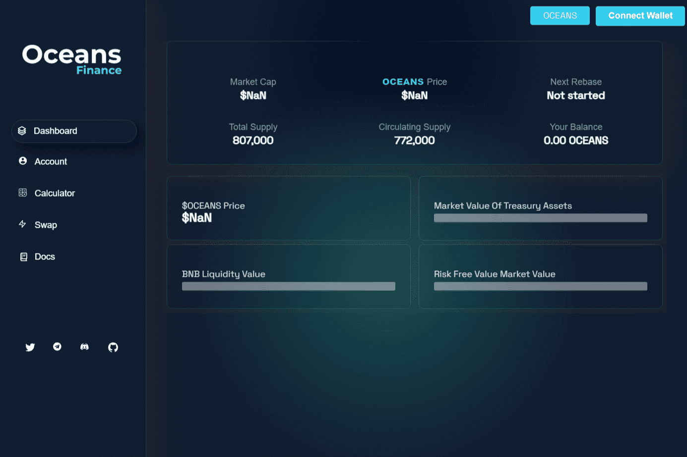

# Oceans Finance

**什么是海洋金融？**

多链自动质押和自动复合 DEFI 3.0 协议

Oceans Finance提供了一种分散的金融资产，通过使用其独特的协议，以可持续的固定复利模型奖励用户。是什么让海洋金融与众不同？

✅稳定币$OCASH 1：1与$BUSD（收益农业，质押）✅包装$wOCEANS兼容的CEX交易所✅代币$CCEANS具有$BUSD奖励✅多链&nbsp;的可证实的APY。

