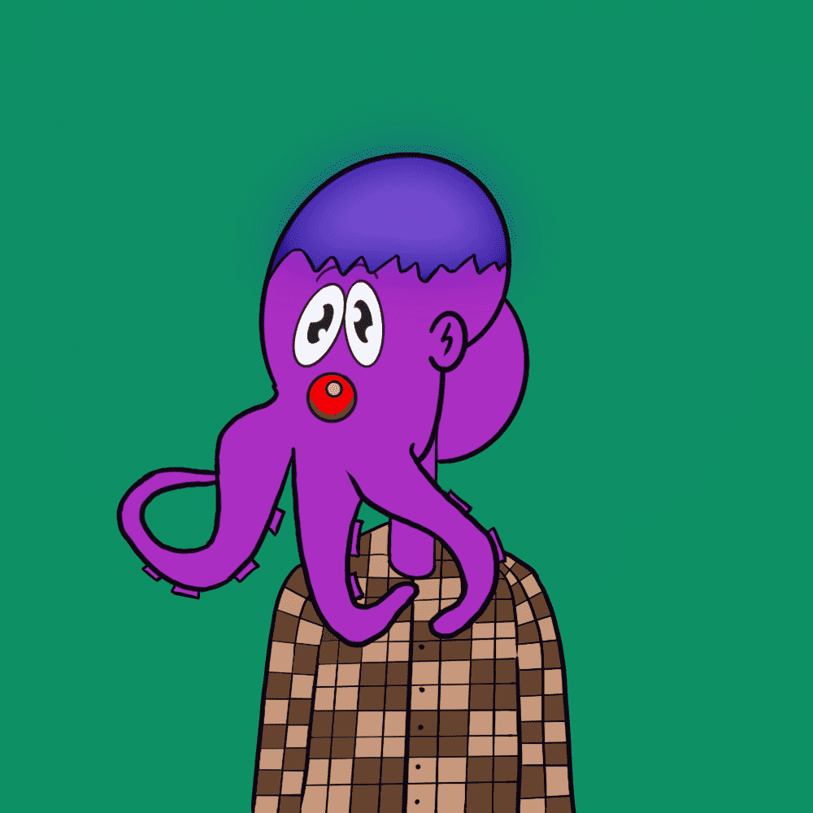

# OctoPeeps

OctoPeeps 是生活在多边形区块链上的 1,000 个 NFT 的集合，它是由 90 多种资产以手绘、编程方式和随机生成的。所有 OctoPeeps 都存储为 ERC-721 令牌

OctoPeeps 是 Polygon 区块链上 1,000 个 NFT 的集合，这些 NFT 由 90 多种资产以手绘、程序化和随机方式生成。章鱼哥们生活在多边形海洋中，就像我们这些人一样，有着多变的情绪和时尚感。所有 OctoPeeps 都存储为 ERC-721 令牌。

设置所有社交媒体帐户（Twitter、Medium、Discord）

在沙盒元节中构建 OctoPeeps 体验。

所有 OctoPeeps 持有者都将有机会空投其 NFT 的 Vox 模型，以便能够在沙盒虚拟世界中使用它。总共将空投 10 个 Voxel OctoPeeps。

启动一个 dapp

当收藏品的 80% 售出时，将进行社区民意调查，以选择捐赠给哪种动物或环境慈善机构。25% 的销售额将被捐赠。

设计并删除新的 OctoPeeps 版本

