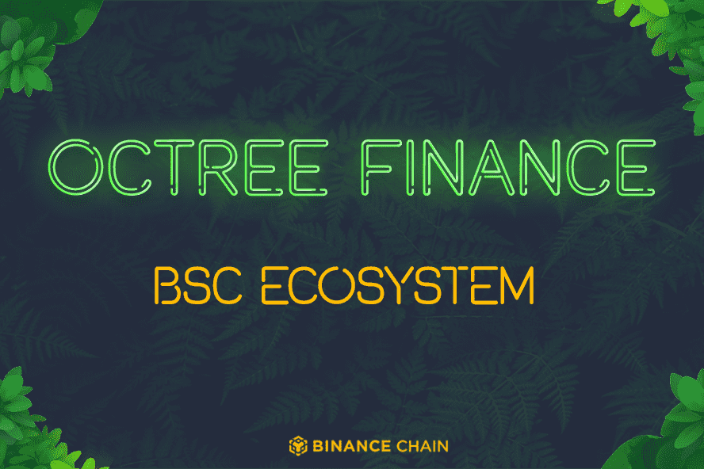

# Octree Finance

**什么是Octree？**

即时收益生成 增强型分配 DeFi 成功的大量服务 扩展收益生成

Octree是一个在平衡计分卡上运行的创新收益生态系统。🌳

Octree协议将立即将1%的交易价值分配给所有快乐的代币持有者，而无需抵押或等待分发。资产将在静止时为您赚取收益

Octree协议将确保某些地址被排除在赚取费用之外。因此，产生的100%费用将归代币的快乐持有者所有。

保险库，彩票，收益优化器，游戏DAPP等 - 我们计划将Octree变成最大的平台，在币安智能链上提供大量独特的服务

随着Octree生态系统的增长，Octree智能合约公开了允许抵押或其他形式的农业与Octree合约交互的功能，以确定每个持有者在任何一段时间内赚取的费用

汽车农场 + 通货紧缩 + 游戏 + 彩票 + 保险库 + Dex 聚合器和更多 ...= 炸弹 💥

