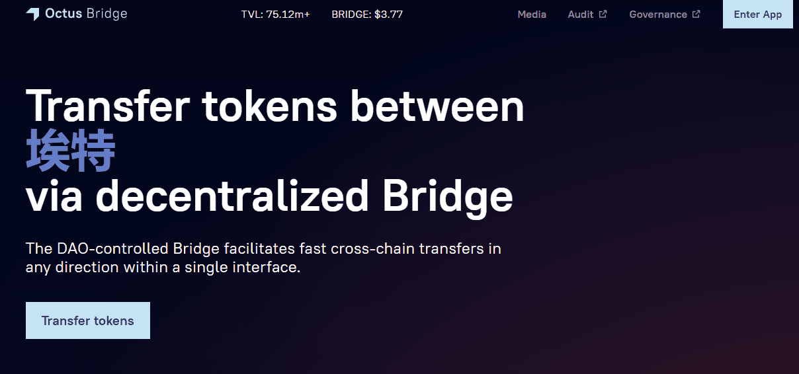

# Octus Bridge

**什么是Octus Bridge？**

由Broxus提供支持的Octus Bridge是一种сross链资产转移，由ETH，BSC，Fantom，Avalanche，Milkomeda，Polygon和Everscale之间的链接组成。

该桥允许用户在几个EVM兼容的区块链之间移动流动性：以太坊，BSC，Fantom，Avalanche，Milkomeda，Polygon和Everscale，在那里它可以以接近零的费用和更高的速度进行交易。

Octus Bridge与所有区块链间桥梁一样，是DeFi生态系统的重要组成部分。

桥梁允许资金在区块链之间流动，以滋养其他DeFi产品，如DEX和贷款。

从Everscale网络中的商业模式角度来看，分散的Octus Bridge也可以被视为分散式银行的类似物。
Octus Bridge通过$BRIDGE令牌使DeFi生态系统更加实惠。

BRIDGE代币构成对业务运营的投票权以及对其收入的要求。

Bridge令牌的主要目的是管理Bridge的DAO（分散的自治组织）。

该产品没有一个单一的决策中心。同时，它有利益相关者，并且根据他们的赌注，他们可以投票决定Octus桥的决定。

任何拥有BRIDGE代币的人都可以投票支持某些运营决策。

