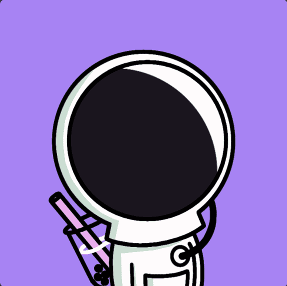

# Oddstronauts 1.0

Oddstronauts 源于两个不太可能的朋友成为兄弟 - Ryan Dylan Selkirk (Aylo) 和 Owen Khang 的愿景，他们着手创新 nft tech/web3 的世界。在大学学习计算机动画后，两人开始了他们在音乐行业创作和指导音乐视频的职业生涯。

由于星系很容易因波巴危机而毁灭，它们正准备进行奇怪的独特行动……

Oddstronauts 是第一个逐帧绘制的 - 完全动画 -10,000 件系列。总共有 478 个特征，每个特征在 108 帧处绘制。

特性：物种、配饰、头盔、内饰、粒子、太空包、套装、上衣、遮阳板和 10x – 1/1 传奇物品。

Post mint – 该团队一直致力于在 Boba Shop 特许经营、服装、开发 Oddstronauts 游戏以及利用区块链技术等方面开展多项创新活动。

