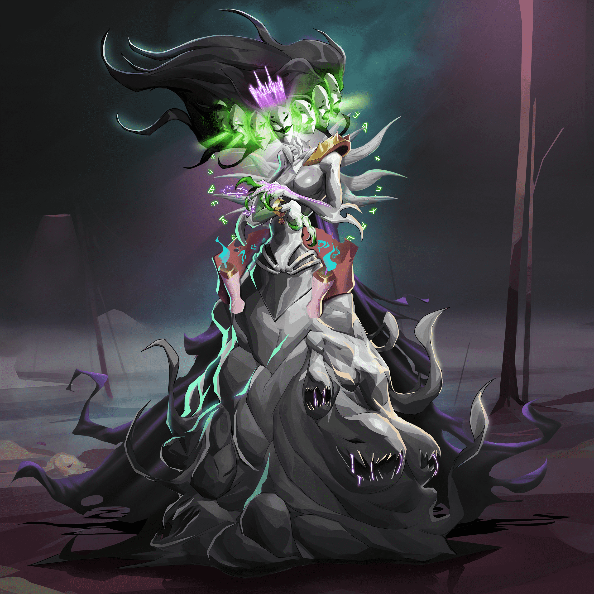

# Clementines Nightmare

欢迎来到克莱门汀的噩梦！当她的世界被来自其他现实领域的噩梦般的生物入侵时，克莱门汀的宇宙发生了前所未有的恶化。她的小镇，她曾经认识的人，全都消失了，被黑暗扭曲了。但就在所有希望似乎都失去了的时候，强大的光之力量从存在中降临，给了克莱门汀和她的朋友们一个独特而激动人心的第二次机会

Clementines Nightmare 是一个 NFT（非同质代币）集合。存储在区块链上的数字艺术品集合。

总共有 5,000 个 Clementines Nightmare NFT。目前，3,107 位车主的钱包中至少有一个 Clementines Nightmare NTF。

