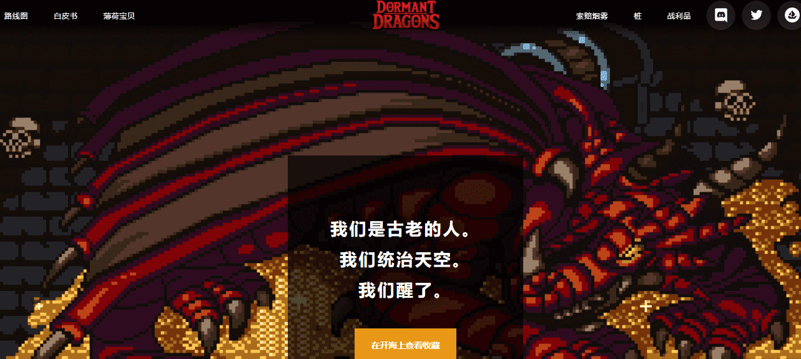

# Official Dormant Dragons

**什么是Official Dormant Dragons？**

由SMOKE令牌控制的P2E生态系统，由5000个Dragon NFT的创世集合生成。

《休眠的龙》最初的想法是为NFT空间带来一些不同的东西，真正以社区为中心。通过这种方式，我们在幕后有一些流程，这些流程将以各种方法奖励休眠龙持有者。

休眠的龙》的主要目标是创建一个引人入胜，有益且可持续的游戏赚取（P2E）2D MMORPG视频游戏。玩家将完全拥有他们所有的资产，允许他们与我们市场上的其他人进行交易。

核心游戏玩法是通过随机生成的地下城和突袭以及单人和团队战斗中的PvP进行战斗。游戏通过拥有一只休眠龙宝宝或其他可玩角色进入，并利用龙战利品箱和土地资源耕作来为等待你的挑战做好准备。

您还可以以其他不依赖于玩核心游戏的方式参与Dragonverse，例如成为资源供应商或在我们的NFT世界中玩得开心。

我们的团队致力于建立Dragonverse的长期愿景。我们始终通过寻找奖励持有者的新方法将社区放在首位，并通过培养敏捷和协作的开发环境来不断保持竞争优势。

