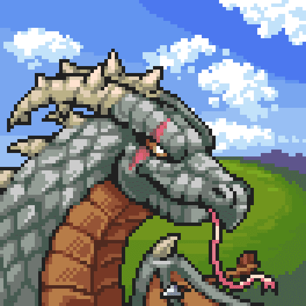

# Official Dormant Dragons

Dormant Dragons 的主要目标是创建一款引人入胜、有回报且可持续的 Play to Earn (P2E) 2D MMORPG 视频游戏。玩家将完全拥有他们所有的资产，允许他们在我们的市场上与其他人进行交易。 ‍ 核心玩法是通过随机生成的

拥有幼龙或其他可玩角色即可访问该游戏，并利用龙战利品箱和土地资源耕种来为等待您的挑战做好准备。
‍您还可以通过其他不依赖于核心游戏的方式参与 Dragonverse，例如成为资源供应商或在我们的 NFT 世界中玩乐。
‍
我们的团队致力于构建 Dragonverse 的长期愿景。我们始终将社区放在首位，寻找奖励持有者的新方法，并通过营造敏捷和协作的开发环境来不断领先于竞争对手。

