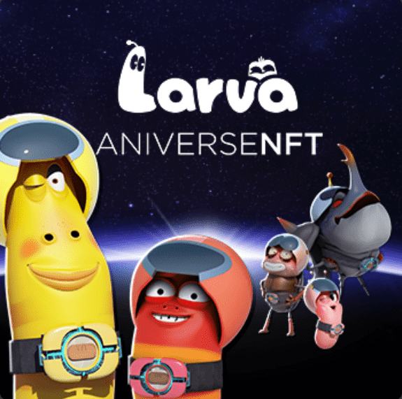

# Official Larva

Aniverse NFT 通过自己的 PFP NFT 作为角色参与到 角色 元宇宙“Aniverse”中，来自各种作品的角色聚集在一起。

我们提供游戏、NFT、Staking、治理参与等多种内容 ，
元界通过新角色的涌入，通过新内容不断扩展。

Aniverse的代表角色Larva
是第一个PFP NFT ，可以作为第一个构建生态系统的角色参与 Aniverse的角色metaverse 。

熔岩是一系列具有“红色”和“黄色”、“粉红色”、“棕色”和“黑色”等各种魅力的小虫子角色，以及具有代表性的毛毛虫角色“红色”和“黄色”。是一部闹剧喜剧动画。

下水道、老房子和纽约街道！
人世间，各种至今未见的危险事物，正等着红黄相间。
从严寒和炸弹般的雨滴到锋利的老鼠门牙和双鸽！

红黄相间，可爱的小毛毛虫，人间的口香糖，废弃的冰淇淋，硬币，戒指等等，人间的这些东西，都太神奇了。

有时这些事情让他们感到困难和快乐，有时他们为了占有而互相争斗。

像宝库一样的后巷垃圾场、刺激的水上乐园喷泉、五彩缤纷的花坛，Lava 眼中的人类世界里的红黄两色会怎样？

