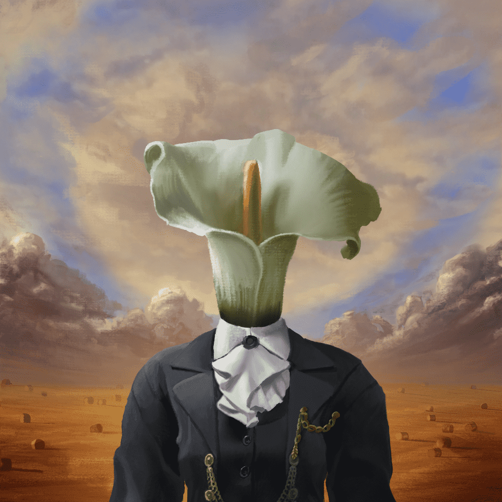

# The Official Surreals

超现实主义是 10,000 张生成肖像的集合，具有超现实的复古自然主义美学。

它们中的每一个都是由一组手绘零件随机组装而成的。没有两个超现实主义是相同的。

超现实是在以太坊区块链上铸造的，只能作为 NFT（非同质代币）购买。

我们对这个项目的愿景包括两部分：

1. 通过提供独特的、高质量的手绘美学，提高个人资料图片艺术的美感。每个超现实主义组件都使用模拟真实油画颜料的技术和工具以数字方式绘制在单层中。
2. 收藏家和社区将确定每个超现实主义的价值及其特征。我们的目标是提供一个环境，让这个发现对每个人来说都是可能的和有趣的。

   
