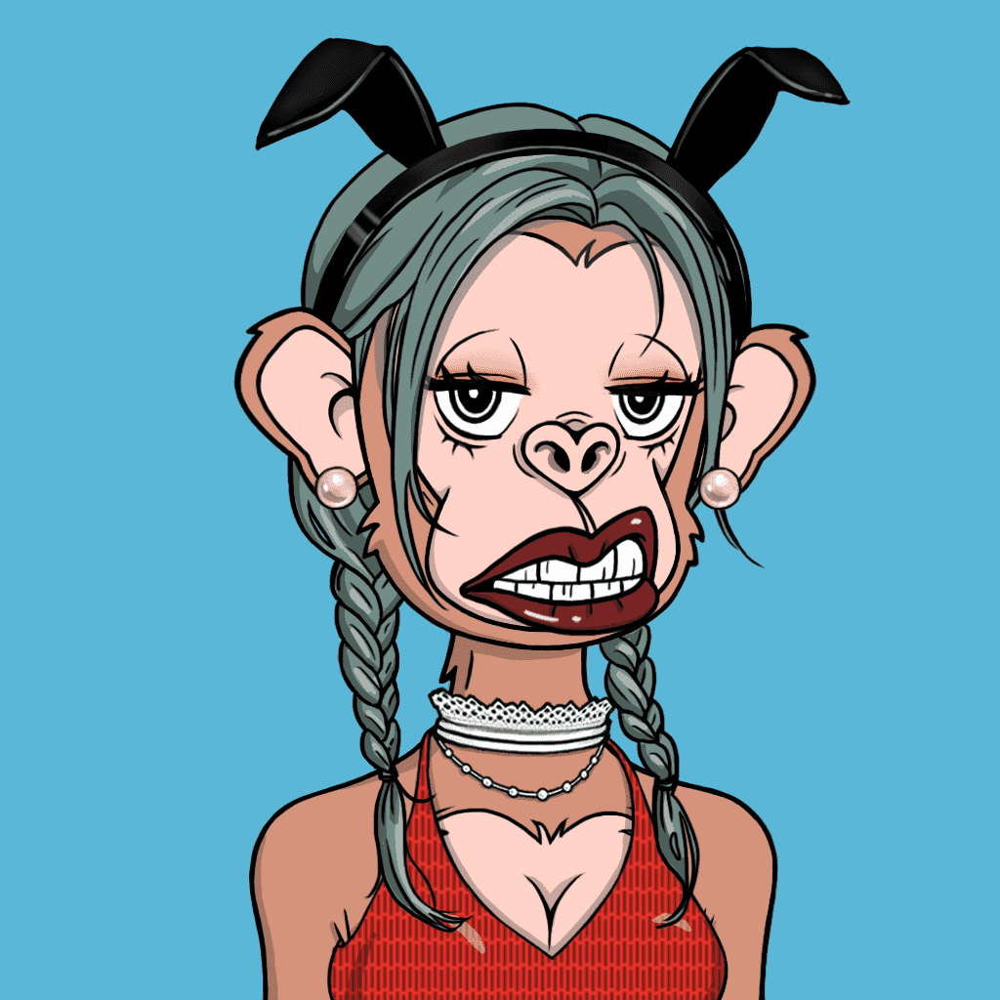

# Toxic Ape Official

毒猿是 Metakongz 在探索神秘的至宝岛时遇到的一种有吸引力的猿。异域风情又帅气的Metakongz在那里会经历什么？

Toxic Ape Girls NFT - 常见问题（FAQ）
▶ 什么是毒猿少女？
Toxic Ape Girls 是一个 NFT（非同质代币）系列。存储在区块链上的数字艺术品集合。
▶ 毒猿少女代币有多少？
总共有 1,264 个 Toxic Ape Girls NFT。目前 2 位所有者的钱包中至少有一个 Toxic Ape Girls NTF。
▶ 最近卖了多少毒猿少女？
过去 30 天内共售出 0 个 Toxic Ape Girls NFT。

