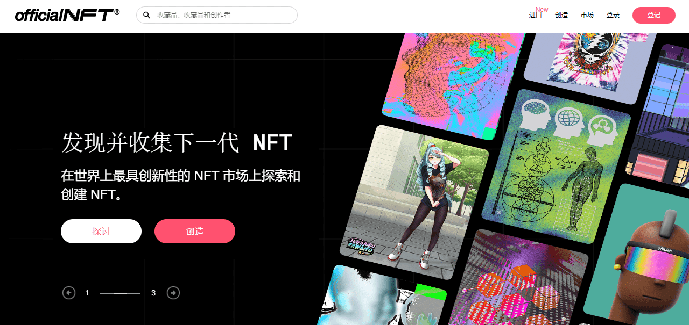

# OfficialNFT®

**什么是官方NFT®？**

OfficialNFT®是一个动态的NFT生态系统，使个人，艺术家，品牌和实体能够在精心策划的市场中铸造和部署一套高度可定制的智能合约，并为minters和最终零售买家提供最佳用户体验。

创建和销售 NFT 产品：让我们在官方NFT市场上创建，铸造和放置您的NFT。我们甚至可以将您的数字艺术与实体产品联系起来，并将这些产品作为双胞胎一起销售。

创建您的产品：您可以将任何东西作为NFT出售！艺术、音乐、物理产品...添加社交链接、描述和分享。
上传您的作品

我们可以轻松上传您的作品，添加多个图像，视频和音乐。

设置集合：分享到您的社交网络，并放置在官方NFT市场上。

