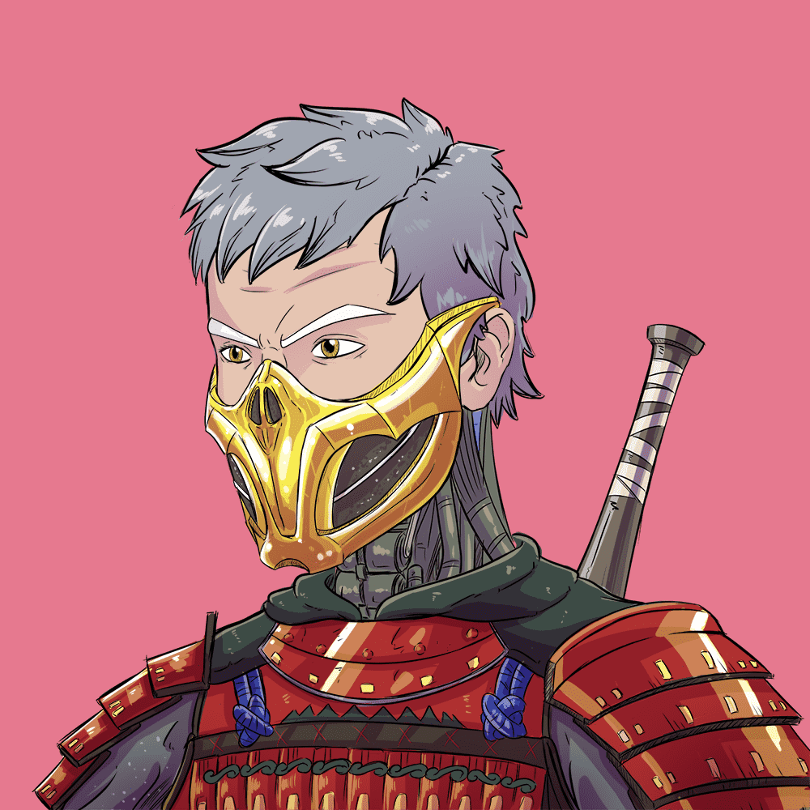

# Official Project Shura

2500年，位于东京的一个日本政府秘密项目被泄露，5500名改装过的士兵准备部署。启动修罗计划。Project Shura 是由一位名叫 Akihiro 的才华横溢的日本地下艺术家绘制的 5,500 个 NFT 的集合。

官方项目 Shura NFT - 常见问题（FAQ）
▶ 什么是官方项目修罗？
官方 Project Shura 是一个 NFT（Non-fungible token）集合。存储在区块链上的数字艺术品集合。
▶ 有多少官方 Project Shura 代币？
总共有 997 个官方 Project Shura NFT。目前有 2 位所有者的钱包中至少有一个 Official Project Shura NTF。
▶ 官方Project Shura最近卖出了多少？
过去 30 天内共售出 0 个官方 Project Shura NFT。

