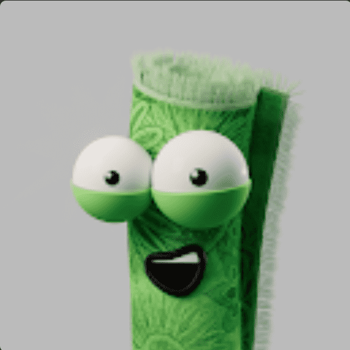

# OfficialRuggies

Ruggies 是一个正在建设的社区，您可以在其中分享和检查您正在经历的事情。我们都分享了负面经历，我们希望创造一个氛围良好、气氛友好的环境，让人们可以轻松地谈论他们的想法。

NFT / 加密货币领域可能存在大量资金，当出现问题时，可能会对我们的情绪和心理健康产生严重影响。虽然谈论我们的胜利和收获很容易，但谈论我们的损失和负面经历并不常见。

70% 的铸币收益和 50% 的二次特许权使用费将直接返还给项目和社区

该团队正在将大量资金分配到旨在直接返回项目和社区的钱包中，从而为社区提供大量赠品和抽奖活动。
地毯回购基金：
还记得你钱包里那些为 0 并且你认为永远不会出售的 NFT 吗？莱佛士将在不和谐中选择一些幸运的橄榄球持有者，并将 ETH 奖品发送给他们，以换取他们毫无价值的 NFT。
学习和支持课程：
如果您是 Ruggies NFT 持有者，您将能够参加每周一次或两次在 discord 中发生的事件。这些活动将包括小组支持会议、引导式冥想和有关 NFT 空间的主题，人们在这里分享他们的知识和经验，供我们学习。

