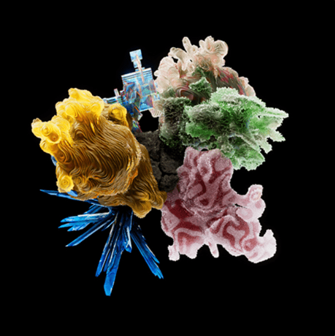

# OG:Crystals

10301 个独特的 3D 水晶的生成艺术项目将演变成集体艺术品。水晶礁将被实现为实体雕塑，并在世界各地的博物馆和画廊中展出。这是一个长期的艺术项目，具有独特的机制，弥合了传统艺术世界和 NFT 艺术世界之间的差距。  由 Michael Joo、Danil Krivoruchko 和 OG:CR 社区创建。

水晶礁是路线图的最后也是最雄心勃勃的阶段。该雕塑将汇集整个系列中的所有 OG:Crystals，并在世界各地的博物馆中展出。这部分路线图的实施阶段确实很复杂，需要对印刷进行迭代测试以及与博物馆和机构本身进行谈判。Michael Joo 目前已经在谈判中。这需要时间，但我们将自豪地为我们的社区聚焦该项目的每个实施阶段。

