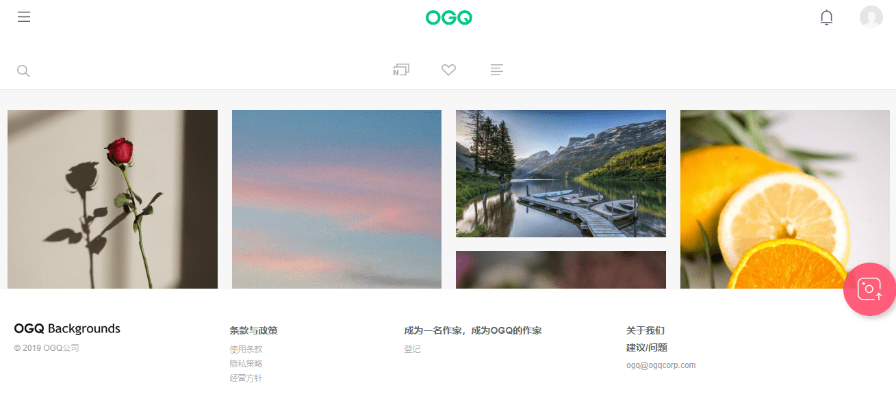

# OGQ

**什么是OGQ？**

OGQ成立于2011年，现在是领先的社交创作者平台之一，内容创作者可以上传和销售数字资产内容（包括贴纸，图像，视频等），其粉丝可以在流媒体模式下查看并下载以广泛使用。全球OGQ市场约有1400万活跃创作者和5400万上传的数字资产内容，如OGQ背景APP，Naver OGQ市场和AfreecaTV OGQ市场。

至于OGQ及其创作者，主要挑战之一是维护内容版权的能力。通过OGQ与本体的合作，2.5亿条OGQ数字资产内容将记录在本体区块链上，从而加强版权保护。

