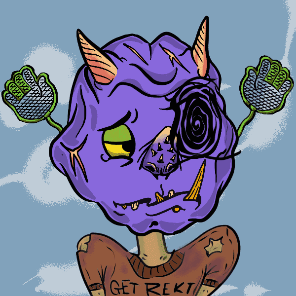

# OgresHood.wtf

食人魔在这里 gruu helpgre groeblin eetgr 精灵。食人魔不像精灵格力。

OgresHood.wtf NFT - 常见问题（FAQ）
▶ 什么是 OgresHood.wtf？
OgresHood.wtf 是一个 NFT (Non-fungible token) 集合。存储在区块链上的数字艺术品集合。
▶ 存在多少 OgresHood.wtf 代币？
总共有 3,333 个 OgresHood.wtf NFT。目前，1,559 位所有者的钱包中至少有一个 OgresHood.wtf NTF。
▶ OgresHood.wtf 最贵的交易是什么？
售出的最昂贵的 OgresHood.wtf NFT 是 ogres #912。它于 2022 年 6 月 15 日（3 个月前）以 0.1 美元的价格出售。
▶ 最近卖出了多少 OgresHood.wtf？
过去 30 天内售出了 7 个 OgresHood.wtf NFT。
▶ 什么是流行的 OgresHood.wtf 替代品？
许多拥有 OgresHood.wtf NFT 的用户还拥有 Quack Ducks War、 Emoticons by Logo、 pablitaslol和 OGRES.wtf。

