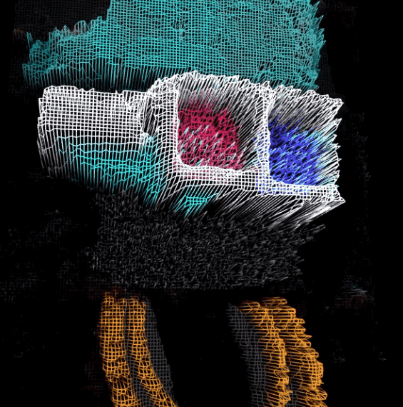

# OGs by JakNFT x Kotegawa

OGs 是限量版 PFP 系列，将 JakNFT 和 Hiroji Kotegawa 的风格融合成一种全新的艺术形式。

OG 是使用结合了故障、动画、雕刻和 3D 建模的特殊工艺创建的。
仅存在 369 个 OG。每个 OG 都是独一无二的，手工制作，并且经过精心策划。

OG 角色有 11 种类型：人类、突变体、帽衫、猿、阳光、僵尸、机器人、佩佩、幽灵、外星人和 MFER。

OG 是 CC0。对他们做任何你想做的事。

OG 是一群堕落的故障 mfers，他们从 JakNFT 的[HOODIE GANG](https://opensea.io/collection/jaknfthoodies)中脱离出来， 并在 The Jakverse 的远东一侧形成了一个敌对的团队。OG 和 Hoodies 有着相同的根源，但他们正在进行一场残酷的故障战争，看不到尽头……

