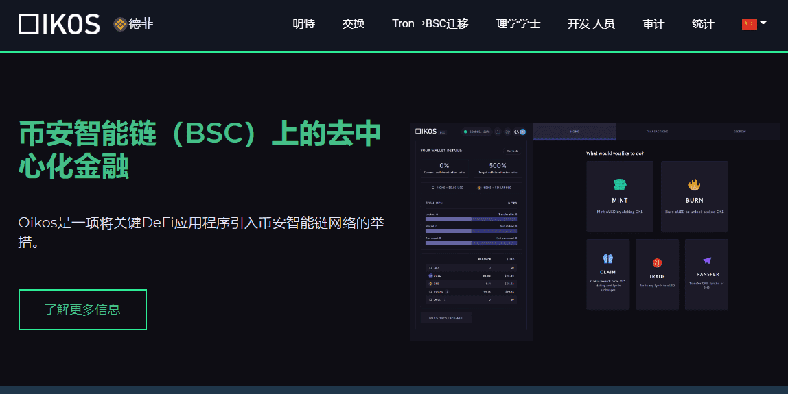

# Oikos.cash

**什么是Oikos.cash？**

分散式合成资产Oikos是Synthetix的Tron端口：一个合成资产平台，提供法定货币，商品，股票和指数的链上敞口。合成资产（Synths）由Oikos网络代币（OKS）支持，该代币作为抵押品锁定在智能合约中。

Synths跟踪各种资产的价格，允许加密原生和无银行账户的用户在Oikos交易所交易P2C（点对合约），而不受流动性限制。

Trustless Token Exchange Oikos Swap是Uniswap的Tron端口：一个无需信任的去中心化交易所，允许用户交易任何基于Tron的令牌，而无需任何存款或取款到集中式订单簿。更好的是，Oikos Swap流动性池对于绝大多数交易几乎没有滑点。任何人都可以通过添加或删除流动性来贡献，以交换费用以及以 OKS 代币支付的奖励的形式获得佣金。

