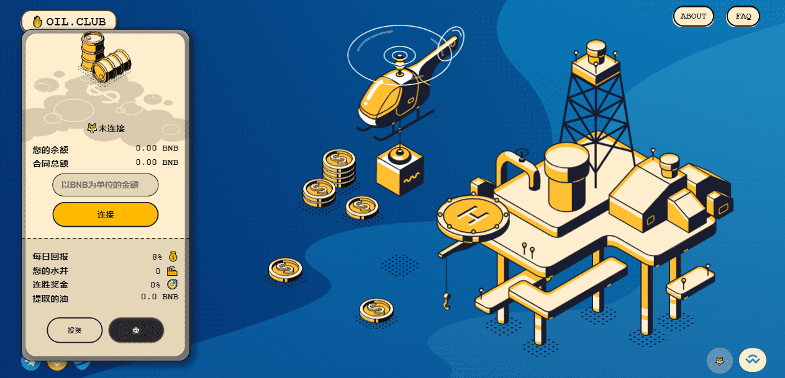

# Oil.Club

**什么是 Oil.Club？**

什么是石油俱乐部智能合约？资产代币化是能源行业的未来吗？投资石油俱乐部是否为时已晚？
石油俱乐部是一个遵循石油和天然气行业规则的智能合约矿工。俱乐部会员每天可赚取高达14%的奖励，并参与不断发展的策略，以根据当前的市场状况实现利润最大化。

石油行业代币化的概念最初由Ziyen Energy以ZiyenCoin的安全代币发行形式提出。

Ziyen Energy在美国收购了三份石油和天然气租约，最近购买了帕克县和怀斯县40口石油和天然气井的工作权益。

智能合约开辟了一个充满机遇的新世界，彻底改变了投资和资产的发行、管理和交易方式。资产代币化正处于曙光，Ziyen Energy是该行业这一变化的矛尖。

虽然石油俱乐部智能合约不会给你油桶或真正的油井或土地，但它肯定可以给你带来可持续的回报，提供稳定的回报，从每天8%开始，如果你遵循他们的投资准则，就会上升到14%。考虑到获利或再投资没有限制，复利将成为决定您的回报数量的重要因素。但为时已晚吗？

智能合约背后的算法调节了俱乐部名为OIL的“代币化资产”的价格，如果太多成员出售他们的OIL而不是租赁更多的WELLS和库存OIL，他们的回报就会通过暂时降低利率和OIL价格来减少，允许新投资者以优惠的价格进入并从那里计算他们的利润。

上述算法创建了一个可持续的财务模型，允许新成员进入任何阶段并开始赚钱。

