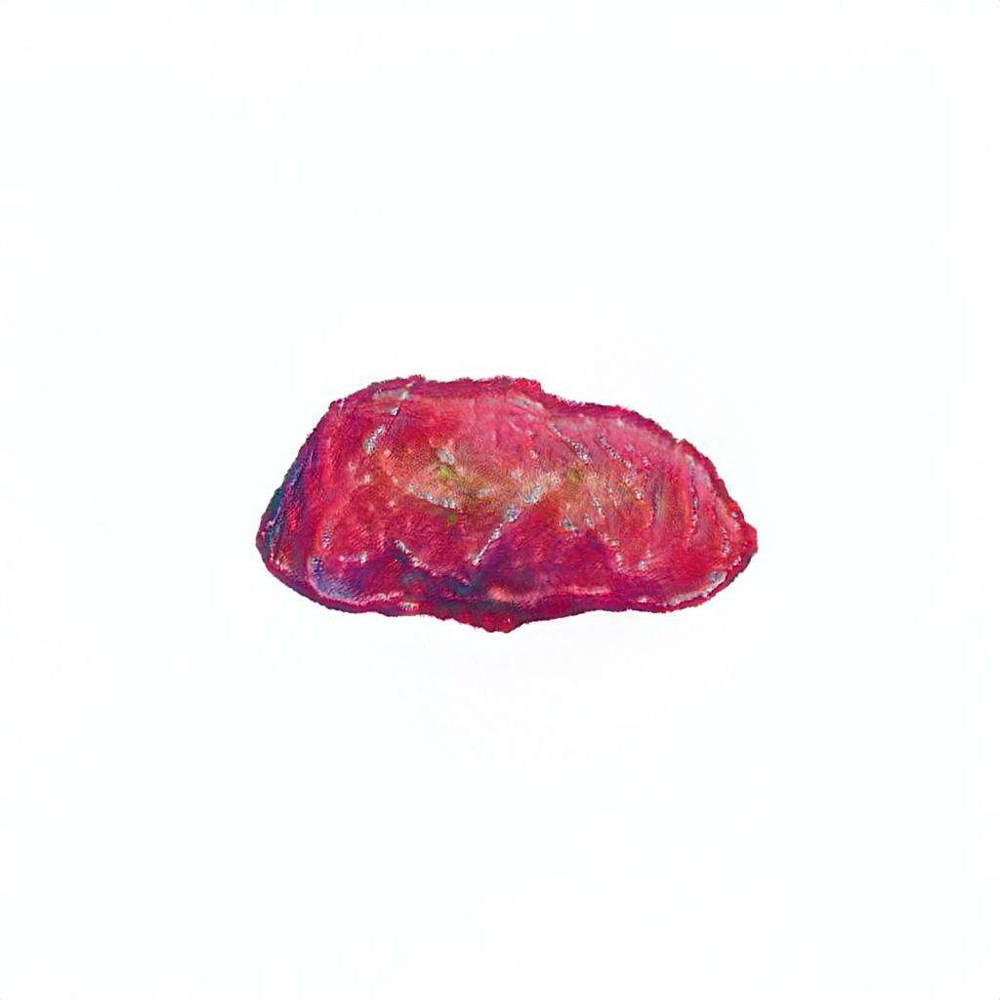

# Oilys Pebbles

Oilys Pebbles 是 Logan Larkin 和 localmachine 以 2000 Pebbles 为特色的集合。通过 GAN 处理使用 100 个原始手绘鹅卵石来创建一系列随机生成的稀有油石鹅卵石。

Oilys Pebbles NFT - 常见问题（FAQ）
▶ 什么是油性鹅卵石？
Oilys Pebbles 是一个 NFT（非同质代币）集合。存储在区块链上的数字艺术品集合。
▶ 有多少个 Oilys Pebbles 代币？
总共有 2,000 个 Oilys Pebbles NFT。目前，601 位业主的钱包中至少有一个 Oilys Pebbles NTF。
▶ 什么是最昂贵的 Oilys Pebbles 销售？
售出的最昂贵的 Oilys Pebbles NFT 是 Pebble #1439。它于 2022-08-13（21 天前）以 133 美元的价格售出。
▶ 最近卖出了多少颗 Oilys Pebbles？
过去 30 天内售出了 8 个 Oilys Pebbles NFT。
▶ 什么是流行的 Oilys Pebbles 替代品？
许多拥有 Oilys Pebbles NFT 的用户还拥有 Old Legacy、 WaterBe4nZukis、 DoNotMintThis和 DegenOkayBears。

