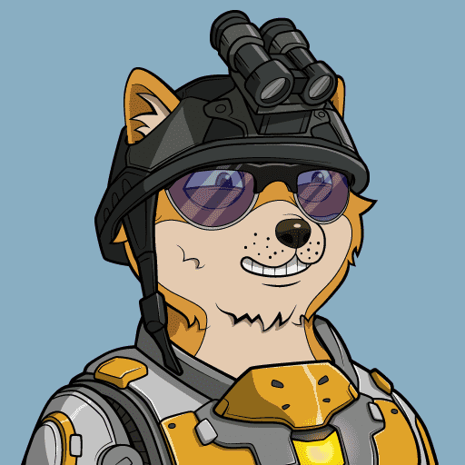

# OkayDog

小镇曾经有人居住，但有一天发生了一件事情，导致科尔马的人们变成了狗人。 事情突如其来，科尔马的人们一时间陷入了恐慌。 几个尊重狗的人聚在一起，组成了一个理事会，帮助其他狗人，让科尔马越来越好。 之后会发生什么？

OKAY DOG 是一个社区驱动的项目。NFT总量为10,000。NFT 是在以太坊区块链上随机生成的。在这里，我们可以满足您对狗的所有想象。OKAY DOG 的每一次 NFT 都会以各种形式回馈社区成员，以促进动物世界的健康、多样性和可持续性。

