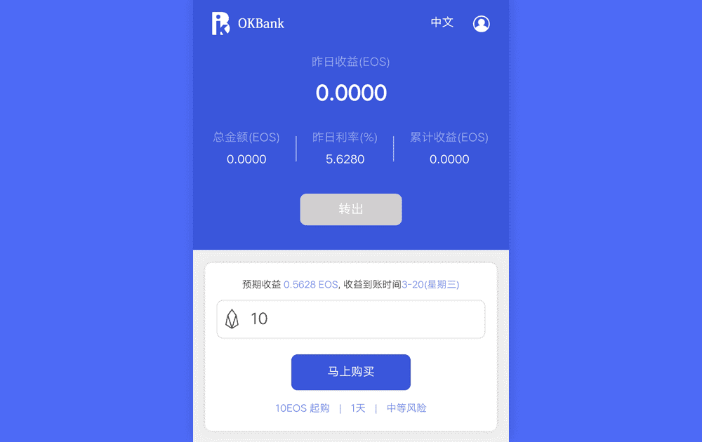

# OKBank

**什么是 OKBank？**

OKBank是智能合约的三重加密，保证了资金安全，超短期日间产品，灵活自由转账，稳定收益和最高日利率为20%的产品。

还行！手机银行是OK的主要银行服务！印度尼西亚银行，旨在为具有高流动性的动态个人提供服务。此服务将使您的银行业务需求更容易访问所有银行功能，例如： - 查看您的帐户以及交易和借记卡历史记录。- 通过LLG和在线转账进行国内转账。- 在线购物和账单支付。- 转移计划。- 开立存款账户。亲临离您最近的分行注册OK！手机银行。

