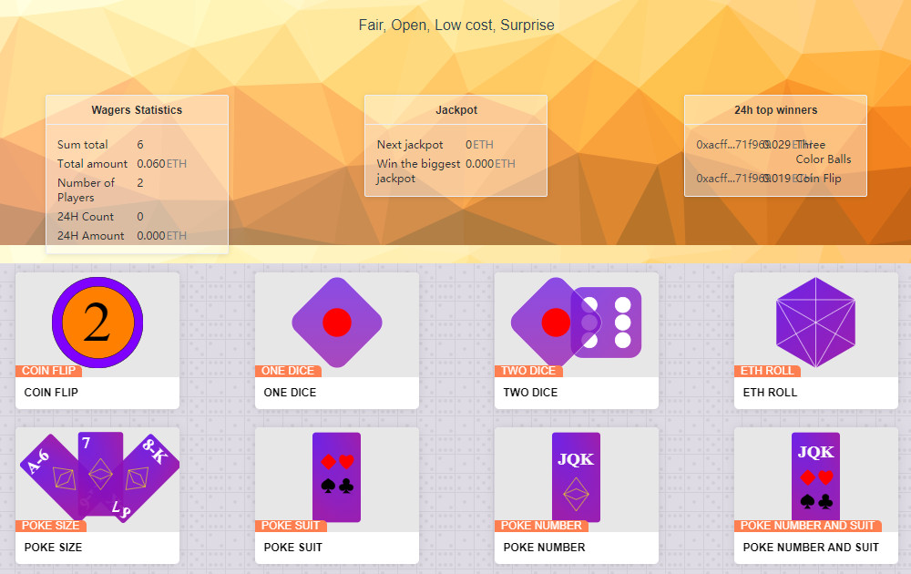

# okdice.io

**什么是 okdice.io？**

okdice.io 是一个赌博dApp。它基于以太坊。该平台允许您玩骰子游戏。它们是分散的，并且由智能合约驱动。如果幸运的话，您也可以赢得大奖！

Okdice.io 在智能合约区块链以太坊上创建 Okdice.io 游戏是公平，开放，低成本和更令人惊讶的。试试你的运气，赢得头奖。

okdice.io dApp是建立在以太坊协议上的赌博类别的加密资产。现在，根据用户数量，它在一般dApp排名中排名第6260位，在赌博类别中排名第979位，这使您可以很好地了解 okdice.io dApp在其竞争对手中的表现。

通过分析过去30天内 okdice.io dApp数据，很明显，dApp的余额为26.1K美元，交易量稳定在0.00美元。okdice.io 在 30 天内生成了 0 个事务，下降了 -100%。显然，与前7天相比，交易量稳定了0%。最近7天的数据显示，okdice.io 用户群为0，并且稳定了0%。
