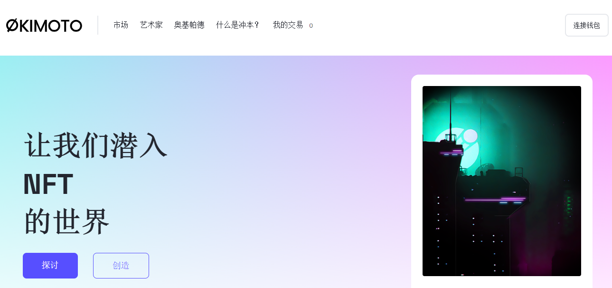

# Okimoto

**什么是Okimoto？**

Okimoto是Zilliqa区块链上最先进的分散式不可替代代币交易所。

在冲本上进行交易是一个简单且信任最小化的过程。Okimoto交换建立在完全分散的点对点交换之上，用户不必依赖第三方软件或数据库。用户可以直接相互购买NFT，从而减轻交易对手必须体面行事的压力。

冲本收取0%的销售费用。这使得Okimoto在区块链NFT市场空间中处于边缘地位，大多数交易所占据了5-7%，更不用说传统市场占据了高达12%的份额。

Okimoto将保持0%的销售费用，直至另行通知。

Okimoto允许您以真正完全分散的方式创建不同的列表。

平销 – 列出您的NFT的最简单方法。只需设置价格和持续时间，您就可以开始了。

拍卖 - 为您的惊人艺术品发现价格。只需设置价格和持续时间，出价最高的人就会认领您的惊人作品。

平仓销售和拍卖只是冲本平台的开始，更多选择即将推出。

低交易费用

Zilliqa提供了区块链领域一些最便宜的费用，上市/购买NFT的典型gas是0.002 ZIL。与以太坊区块链的费用成本相比，这是微不足道的，使Zilliqa成为NFT销售的具有成本效益的替代方案。

