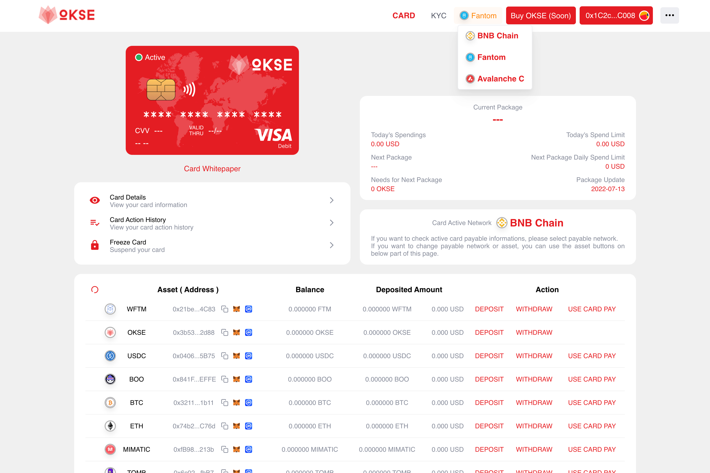

# Okse Card

**什么是Okse卡？**

Okse钱包旨在创建与Visa / Mastercard卡等法定世界应用程序相关的完全分散的金融体验。

这是通过将金融交易中的所有第三方（例如银行和中间人）替换为一个或多个智能合约来实现的。这不仅是因为对传统金融机构的不信任，也是为了避免信用卡/借记卡欺诈或身份盗用。

一张Visa卡，分散资助。在全球范围内使用加密货币的最简单，最快捷的方式。

一种Visa卡，它使加密货币与银行中的钱一样可消费，但资金分散。您的加密货币就是您的加密货币。在170多个国家/地区提供，并准备在全球超过6000万个Visa商户上使用。

分散和审计的资金存储（智能合约）。Web3登录和更多，以确保您的资金安全。选择您的付款货币和网络。只需几秒钟即可在BNBChain和其他可用网络之间切换。

