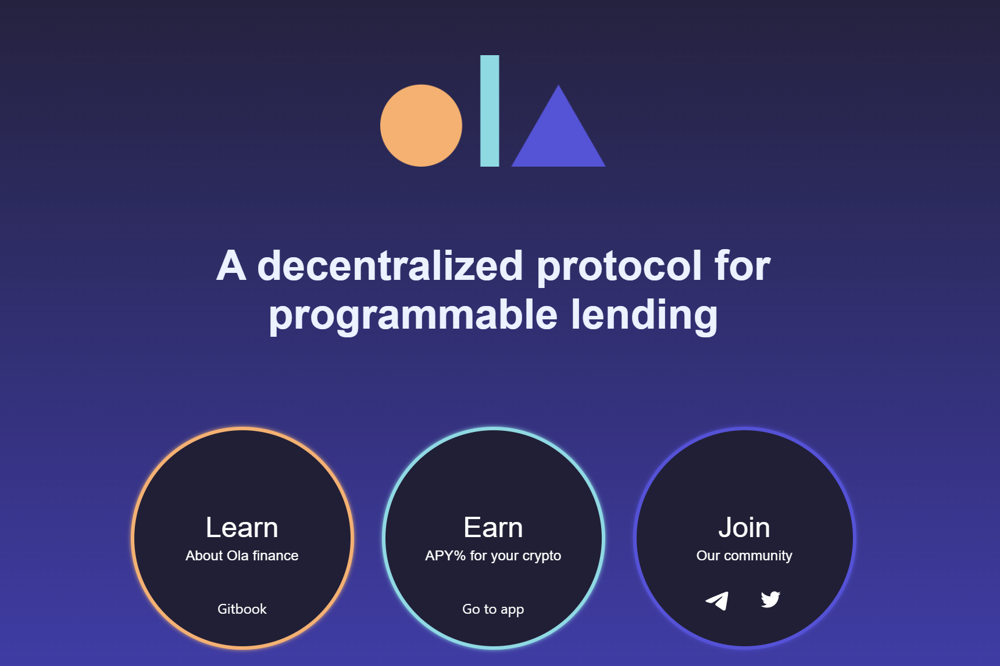

# Ola finance

**什么是Ola Finance？**

一个去中心化的协议可编程贷款。

Ola Financial Services Private Limited是一家私人公司，成立于2007年2月24日。它被归类为非政府公司，并在班加罗尔的公司注册处注册。

Ola Finance是一个平台，允许任何人创建一个类似化合物的实例，其中包含他或她喜欢的任何代币。Ola的目标是扩大向社区提供借贷服务的代币范围，同时限制平台用户面临的风险水平。

通过并排运行多个类似化合物的实例，每个实例都有自己的风险状况，用户可以自由地与那些符合其风险偏好的实例进行交互。

