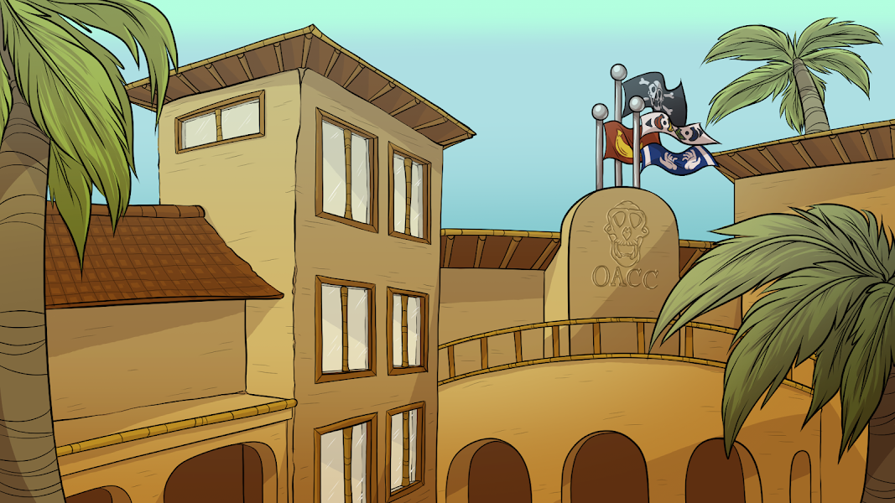

# Old Ape Country Club Official

一个由 5000 只老年猿组成的专属俱乐部，他们在年轻时模仿 NFT 和 Crypto 后，正在享受他们的后半生。每个 Old Ape 都是独一无二的，并通过各种可能的特征以编程方式生成，包括表情、头饰、服装等。所有的古猿都是涂料，但有些比其他的更稀有。▶ 什么是老猿乡村棒球？
老乡村俱乐部官方是一个NFT（非同质代猿币）集合。存储在区块链上的数字收藏品集合。
▶ 老猿乡村俱乐部官方代币有多少？
1,00个乡村俱乐部官方5,00有一个老猿俱乐部官方NFT。目前94辆老猿俱乐部的钱包中至少有NTF。
▶ 最贵的老猿乡村俱乐部官方促销是什么？
最贵的老猿乡村俱乐部官方NFT是#471。它于2022-06-17（2个月前）以219.6美元的价格售出。
▶最近卖了多少老猿乡村俱乐部官方？
过去30个经典乡村俱乐部NFT官方出65个。
▶ 一位老猿乡村俱乐部的费用是多少？
过去 30 天，Old Ape Country Club 官方 NFT 的中天价格为 47 美元 25 美元，最多超过 77 美元。

