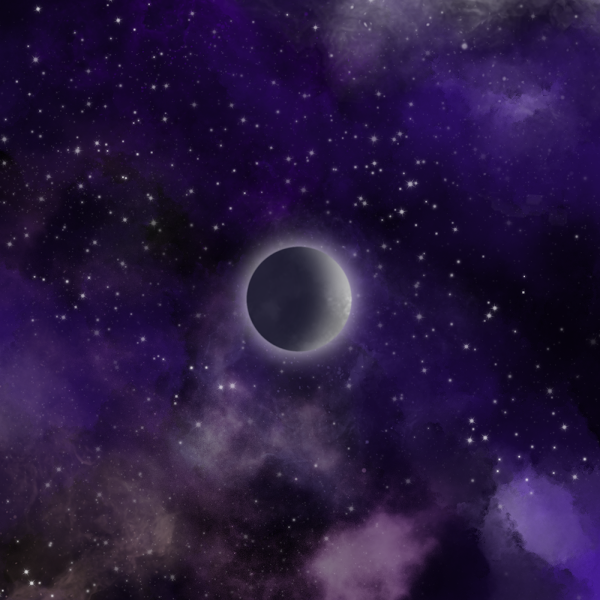

# Old ColorDot

就像点聚在一起形成线条、平面和空间一样，Color Dot NFT 是一个将各种颜色的持有者连接成一体的项目。分级参与权和代币焚烧。我们将始终思考和思考什么对持有者更有利，并发展。Apple Inc. “第一个故事是关于连接点的。”史蒂夫乔布斯来自就像演讲一样，我们将形成一个巨大的社区，连接持有者和持有者、持有者和团队，甚至是其他项目。
 我将创建一个 DAO，将各种颜色的持有者连接成一个整体，就像点变成线，平面最终变成空间一样。

