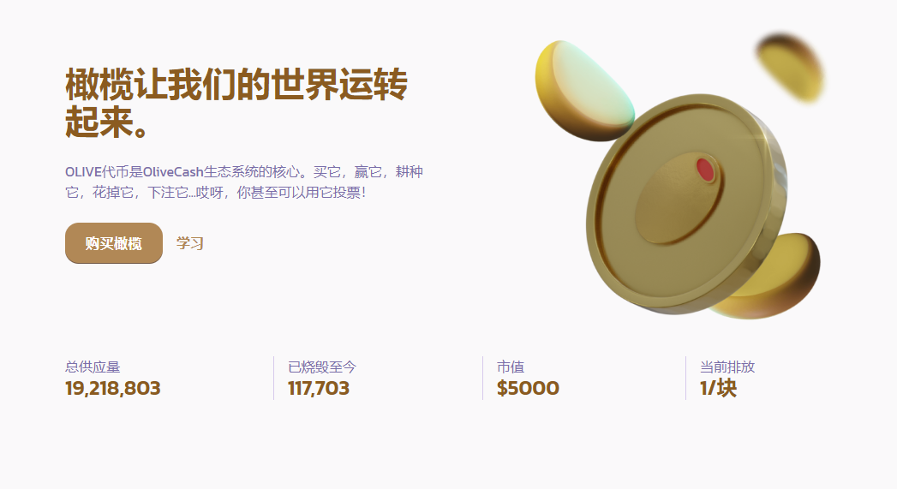

# Olive Cash

**什么是Olive.Cash？**

是什么让Olive.Cash与其他所有“农场”不同？我们是一支经验丰富的开发人员团队，他们非常喜欢DeFi运动，并愿意投入您的时间将这个项目提升到一个新的水平。我们猜你厌倦了地毯拉扯，我们也是！使命 我们的使命是通过提供简单的用户界面，促进对DeFi的访问以及创建永久通货紧缩令牌Olive令牌，在平衡计分卡和雪崩上创建最经济可持续和最容易获得的收益农业社区。

Vision OliveCash的目标是通过促进传统投资者参与加密生态系统来促进AMM，Yeild Farming和DeFi市场。

扩大潜在的市场范围需要简单流畅的界面以及菲亚特和加密市场之间更容易的连接。为了提高协议的经济可持续性，我们的目标是增加燃烧费用，并确定额外的通货紧缩策略，使持有人受益。价值获取、努力工作、价值交付和长期增长是我们的首要任务。

