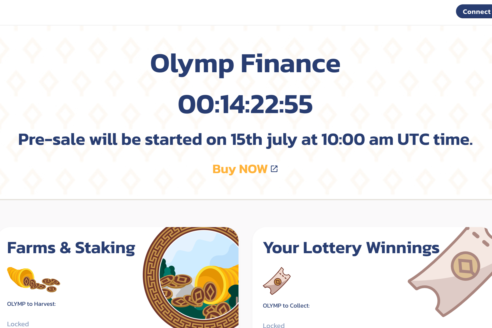

# Olymp Finance

**什么是奥林普金融？**

欢迎来到奥林普金融，它是新一代DEX（分散式交易所），最低兑换率为0.1%，是币安智能链上非常有利可图的农场选择。

奥林普金融交易所是一个自动化做市商（AMM），允许用户在币安智能链网络上交换代币。提供给交易所的流动性来自流动性提供商（“LP”），他们将代币押在流动性池中。作为交换，用户获得LP代币，这些代币也可以抵押以在“农场”中赚取OLYMP代币。

**什么是令牌刻录，为什么重要？**

令牌燃烧是永久从流通中移除硬币的过程，从而减少了总供应量。令牌刻录通常由特定加密货币资产背后的开发团队执行。这可以通过多种方式完成，最常见的是将硬币发送到所谓的“死地址”。

