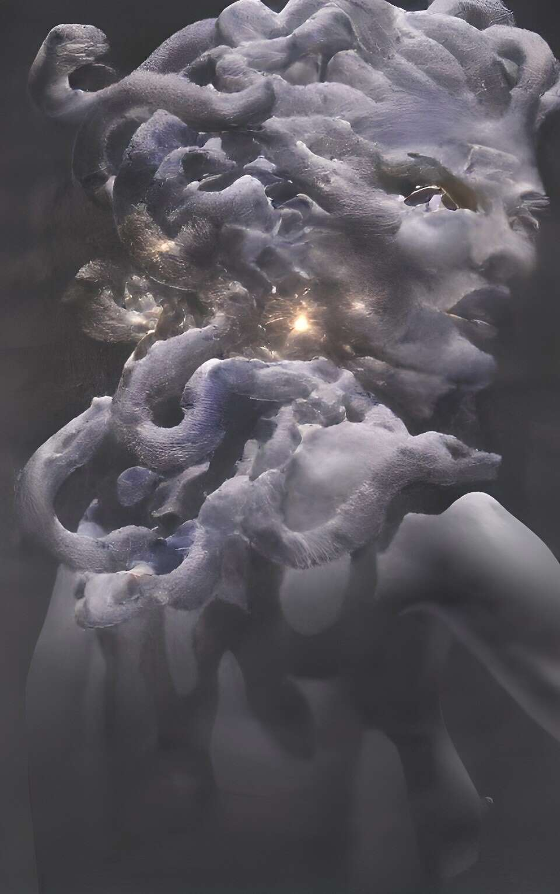

# Olympian Elements

有时你必须退后一步才能看到更大的图景

Olympian Elements NFT - 常见问题（FAQ）
▶ 什么是奥运元素？
Olympian Elements 是一个 NFT（非同质代币）集合。存储在区块链上的数字艺术品集合。
▶ 奥林匹亚元素代币有多少？
总共有 555 个 Olympian Elements NFT。目前，333 位车主的钱包中至少有一个 Olympian Elements NTF。
▶ 最昂贵的 Olympian Elements 促销活动是什么？
售出的最昂贵的 Olympian Elements NFT 是 Olympian Elements #366。它于 2022 年 6 月 22 日（2 个月前）以 162.5 美元的价格售出。
▶ 最近卖出了多少奥林匹亚元素？
过去 30 天内售出了 421 个 Olympian Elements NFT。
▶ Olympian Elements 需要多少钱？
在过去 30 天里，Olympian Elements NFT 最便宜的销售额低于 10 美元，最高销售额超过 32 美元。过去 30 天内，Olympian Elements NFT 的中位价格为 17 美元。
▶ 有哪些流行的 Olympian Elements 替代品？
许多拥有 Olympian Elements NFT 的用户还拥有 Thieves.NFT、 JailTime、 TheSingularity.WTF和 RRMAYC。

