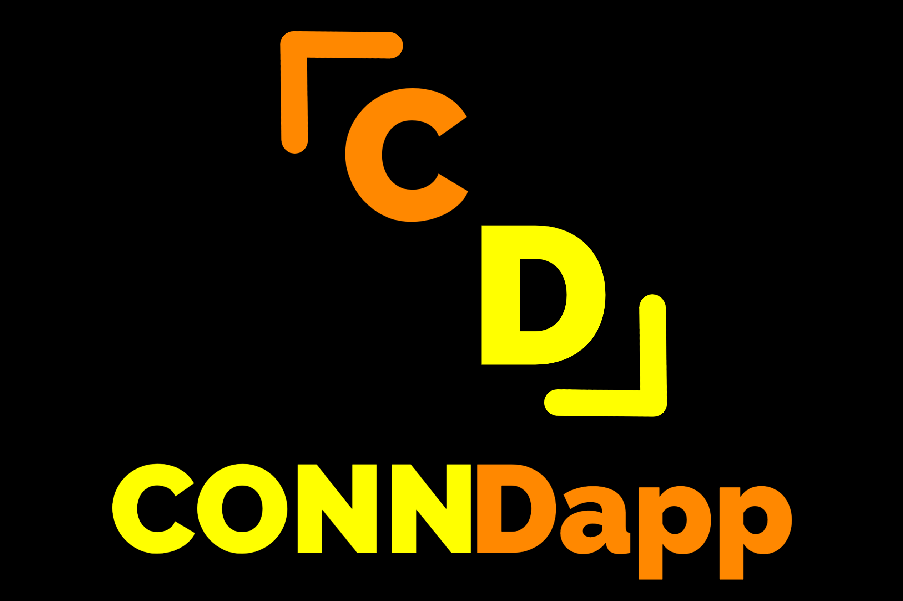

# OlympicStaking

**什么是 OlympicStaking ？**

基于区块链的奥运赌注。 

您可以通过简单的规则投注您的国家或最喜欢的运动员。 

一切都是公平和透明的。

欢迎您以明智的判断进行质押，赚取丰厚的利润，祝大家玩得开心！

与传统投注不同，区块链的去中心化性质提高了游戏的公平性。不会有伪造信息、操纵和欺诈。 

所有交互过程都是公开透明的，可以在区块链上查询。

与以太坊相比，币安智能链的低gas费更适合玩游戏。 

您可以随心所欲地赌注。Bsc 具有多次和少量操作，也比其他侧链或 L2 更方便使用。

根据奥运会的官方赛制，但只有部分比赛有赌注。详细规则请参考规则页面。但是，由于比赛众多，因此没有提及每项赛事的赌注。

如果您担心安全性，我们会发布并验证合约，您可以随时在 Staking 页面进行链上查看。我们也做了特殊的提现方式，以应对游戏取消或其他紧急情况，您的质押金将被退还。

