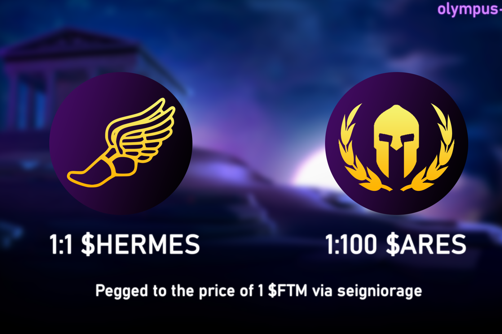

# Olympus Finance

**什么是 奥林巴斯金融？**

Olympus Finance 的灵感来自之前的算法稳定协议，例如 Tomb Finance。就像 2OMB Finance 一样，我们的协议使用三种代币（HERMES、ARES、PLUTO）来激励与 $FTM 的稳定 1:1 挂钩。

该协议的底层机制动态调整 $HERMES 的供应量，使其价格相对于 $FTM 的价格上涨或下跌。受 Tomb 背后最初想法的启发，Olympus Finance 是一个多代币协议，由以下三个代币组成：-Peg 代币（$HERMES）。-股票代币 ($ARES) -债券代币 ($PLUTO)。

