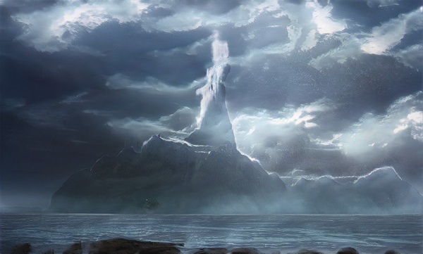

# Olympus Lands

有时你必须退后一步才能看到更大的图景Olympus Lands NFT - 常见问题（FAQ）
▶ 什么是奥林巴斯大陆？
Olympus Lands 是一个 NFT（非同质代币）集合。存储在区块链上的数字收藏品集合。
▶ 存在多少Olympus Lands代币？
47位奥林巴斯NFT，47位奥林巴斯NFT。目前车主的钱包中至少有奥林巴斯
▶ Olympus Lands 最昂贵的交易是什么？
出售的最贵的 Olympus Lands NFT 是 Olympus Lands #286。它于 2022 年 6 月 23 日（2 个月前）以 11 美元售出。
▶ 最近销售了多少奥林巴斯土地？
过去 30 个用户售出 Olympus 53 个 Lands NFT。
▶ Olympus Lands 的价格是多少？
在过去的 NFT 最便宜的美国土地 0 美元的价格为 0 美元，Olympic Land 最多使用 3 块 30 美元的 NFT。
▶ 有哪些流行的 Olympus Lands 替代品？
拥有 Olympus Lands NFT 的用户还拥有来自 SofrikovDemid 的来自乌克兰的结合，这个 Copium 与 Kevins、Lying 和 Alien Clock 相结合。

