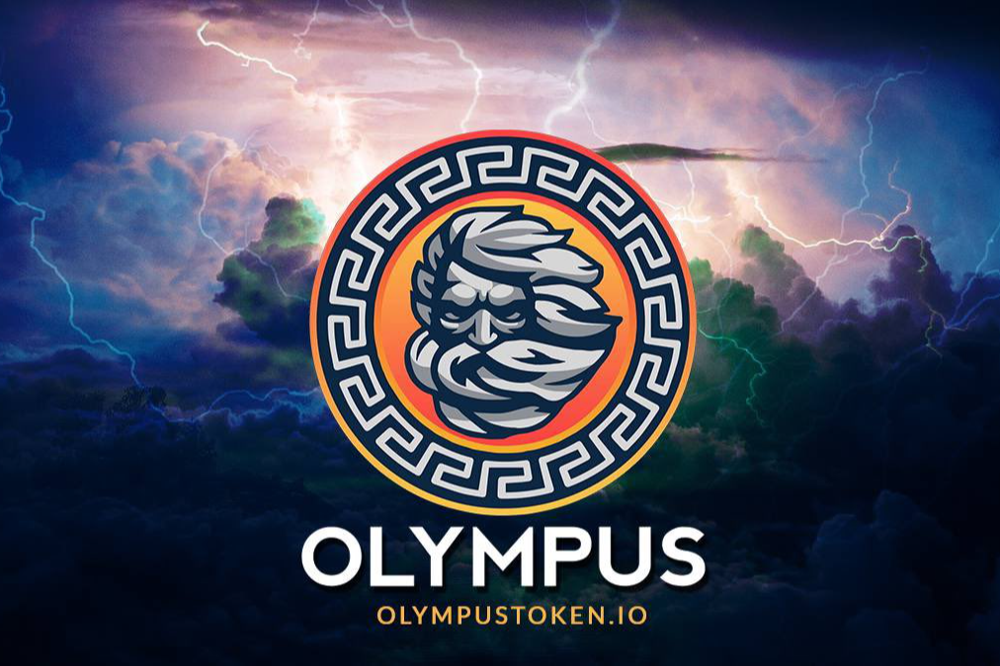

# Olympus

**什么是 Olympus？**

Olympus是一种币安智能链代币，具有双重 BUSD 反射和回购系统，旨在通过每小时奖励来激励长期持有者。Olympus 由 Bogged Finance、Gabecoin 和 Bingus 背后的团队创建，具有动态挂钩的自动流动性生成功能，并集成了反狙击和反机器人功能，以增强保护和健康的代币经济学。

4% 给宙斯。每笔 OLYMPUS 交易都有 4% 的税，用于为代币的回购能力提供资金。

4% 给波塞冬。额外的 4% 被添加到项目的流动资金池中。但是，一旦流动性超过总市值的 25%，盈余将自动用于回购基金。

4% 给 Plutus。每笔交易的 4% 将自动转换为 BUSD 并发送回用户的钱包，从而完成回购周期。
2% 赞成。为了进一步改进和推广 OLYMPUS 代币，收取 2% 的费用，收集到的资金将用于项目的开发。

哈迪斯致敬。每次回购后，销售的交易费用在 30 分钟内翻倍。费用将每分钟自动减少，直到达到正常费率。

